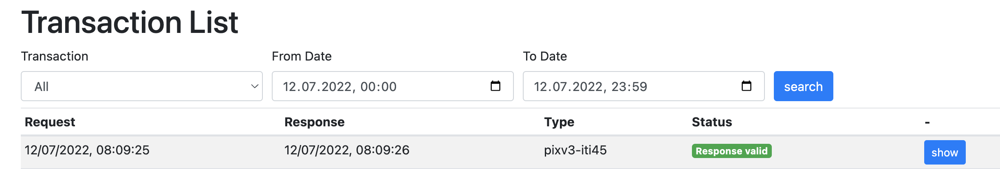

The Integration Kit is available at [https://ikit.cara.ch/dep](https://ikit.cara.ch/dep).

<figure markdown>
  { width="600" }
  <figcaption>Transaction List</figcaption>
</figure>
By default it lists all transactions made during the day. You can filter by IHE transaction type or time range.

## EPR Endpoints

https://adapter.test.emedo.ch/UPIProxy/services/PIXPDQV3ManagerService 
(PIX/PDQ kombiniert analog zum Postsystem und Antworten enthalten AHVN) "
https://adapter.test.emedo.ch/UPIProxy/services/PDQV3ManagerService  
https://adapter.test.emedo.ch/UPIProxy/services/PIXV3ManagerService 
https://adapter.test.emedo.ch/HPD/services/HPDService 
https://adapter.test.emedo.ch/STS/services/SecurityTokenService 
https://adapter.test.emedo.ch/wsproxy/services/SpidQueryService2/ 
https://adapter.test.emedo.ch/wsproxy/services/SpidManagementService/ 

That the requests are routed through **IKIT** the following endpoints need to be configured in your primary system
for IKIT instead of CARA INT for an EPR integration:

| Transaction             | IKIT                                        |
|----------------------------------------------------------------------------------------------------------------------------------------------------------------------------------------------------------------------------------------------------------------------|-----------------------------------------------------------------------------------------------------------------------------|
| Host                    | https://ikit.cara.ch/dep                                |
| Port                    | 443 (https) or 80 (http)                     |
| XDS [[ITI-18]](https://profiles.ihe.net/ITI/TF/Volume2/ITI-18.html)                                    | /eprik-cara/camel/cara/Registry/services/RegistryService          |
| XDS [[ITI-18]](https://profiles.ihe.net/ITI/TF/Volume2/ITI-18.html) Initiating Gateway                 | /eprik-cara/camel/cara/XCA/services/InitiatingGatewayService      |
| XDS [[ITI-41]](https://profiles.ihe.net/ITI/TF/Volume2/ITI-41.html)                                    | /eprik-cara/camel/cara/Repository/services/RepositoryService      |
| XDS [[ITI-43]](https://profiles.ihe.net/ITI/TF/Volume2/ITI-43.html)                                    | /eprik-cara/camel/cara/Repository/services/RepositoryService      |
| XDS [[ITI-43]](https://profiles.ihe.net/ITI/TF/Volume2/ITI-43.html) Initiating Gateway                 | /eprik-cara/camel/XCA/services/InitiatingGatewayService           |
| XDS MU [[ITI-57]](https://profiles.ihe.net/ITI/TF/Volume2/ITI-57.html)                                 | /eprik-cara/camel/cara/Registry/services/RegistryService          |
| XDS RMU [[ITI-92]](https://profiles.ihe.net/ITI/TF/Volume2/ITI-92.html)                                | /eprik-cara/camel/cara/Registry/services/RegistryService          |
| XDS-I RAD [[ITI-69]](https://www.ihe.net/uploadedFiles/Documents/Radiology/IHE_RAD_TF_Vol2.pdf)        | /eprik-cara/camel/cara/Repository/services/RepositoryService      |
| PIX V3 [[ITI-44]](https://profiles.ihe.net/ITI/TF/Volume2/ITI-44.html)                                 | /eprik-cara/camel/cara/UPIProxy/services/PIXPDQV3ManagerService * |
| PIX V3 [[ITI-44]](https://profiles.ihe.net/ITI/TF/Volume2/ITI-44.html)                                 | /eprik-cara/camel/cara/UPIProxy/services/PIXV3ManagerService      |
| PIX V3 [[ITI-45]](https://profiles.ihe.net/ITI/TF/Volume2/ITI-45.html)                                 | /eprik-cara/camel/cara/UPIProxy/services/PIXPDQV3ManagerService * |
| PIX V3 [[ITI-45]](https://profiles.ihe.net/ITI/TF/Volume2/ITI-45.html)                                 | /eprik-cara/camel/cara/UPIProxy/services/PIXV3ManagerService      |
| PDQ V3 [[ITI-47]](https://profiles.ihe.net/ITI/TF/Volume2/ITI-47.html)                                 | /eprik-cara/camel/cara/UPIProxy/services/PIXPDQV3ManagerService   |
| PDQ V3 [[ITI-47]](https://profiles.ihe.net/ITI/TF/Volume2/ITI-47.html)                                 | /eprik-cara/camel/cara/UPIProxy/services/PDQV3ManagerService *    |
| HPD [[ITI-58]](https://profiles.ihe.net/ITI/TF/Volume2/ITI-58.html)                                    | /eprik-cara/camel/cara/HPD/services/HPDService                    |
| HPD [[ITI-59]](https://profiles.ihe.net/ITI/TF/Volume2/ITI-598.html)                                   | /eprik-cara/camel/cara/HPD/services/HPDService                    |
| XUA [[ITI-40]](https://www.bag.admin.ch/dam/bag/de/dokumente/nat-gesundheitsstrategien/strategie-ehealth/gesetzgebung-elektronisches-patientendossier/gesetze/anhang_5_ergaenzung_1_epdv_edi_ausgabe_4.pdf.download.pdf/EPDV-EDI_Anhang_5_E1_DE_Ausgabe_4.pdf)       | /eprik-cara/camel/cara/STS/services/SecurityTokenService          |
| TCU SAML2               | /eprik-cara/camel/tcu                        |
| ATNA [[ITI-20]](https://profiles.ihe.net/ITI/TF/Volume2/ITI-20.html)      | atna.ikit.cara.ch:8080 or :80 (currently 83.228.202.234) unsecured TCP according to [RFC5425](https://www.rfc-editor.org/rfc/rfc5425) |

* PIXV3 and PDQV3 combined and results include Social Security Number

You find an overview of the current relevant specifications and the associated links for the Swiss Electronic Patient
Record EPR
also [here](https://www.e-health-suisse.ch/en/technik-semantik/epr-projectathon/epr-programming-aids/relevant-specifications.html).

## External validation

The IKIT can use the Swiss EVS Client validator to validate various transactions and resources (like XUA assertions 
and ATNA messages). Due to limited resources and rate limiting, the external validation is disabled by default. You 
can enable it for a specific client in the _Clients_ table. It will stay enabled for 8 hours and will be disabled 
automatically.

If the external validation is not enabled, a warning will be shown in the _Validation_ part of the transaction details.