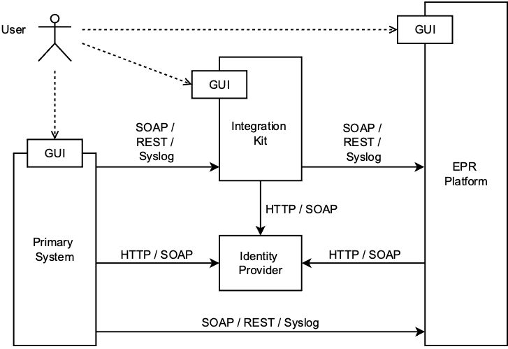

# Primary system integration with CARA

!!! note

    07.07.2025 ikit.cara.ch for emedo: This release  documents the integration with the emedo platform

This documentation describes how the [Integration Kit](https://ikit.cara.ch/dep/) can be used to test
the integration of a primary system with the [CARA](https://www.cara.ch/) integration system.

CARA offers different services:

- EPR [https://portal.test.emedo.ch](https://portal.test.emedo.ch/login)
- Transferts [https://b2b.cara.int.post-ehealth.ch/](https://b2b.cara.int.post-ehealth.ch/).
- PMP (eMedication
  Service) [https://cara-ch.github.io/emed-service-guide/](https://cara-ch.github.io/emed-service-guide/)

To access the integration system you will need to sign a contract/CGUE with [CARA](https://www.cara.ch/) and provide an
OID concept for your organization,
in return you will get:

- an HCP test user for which you need an online authentication yourself (e.g. HIN ID) and connect that HCP test user
  with your online authentication
- two test patients for you with patient access, public test patients are listed [here](testpatients.md)

This will allow you to start the integration of the primary system.

The [Integration Kit](https://ikit.cara.ch/dep/) (short **IKIT**) provides the
following [functionality](usecases.md):

- Authenticate an User and obtain an IdP assertion
- Proxy and log IHE transactions without client certificates and with basic validation of request / response

<figure markdown>
  { width="499" }
  <figcaption>Integration architecture</figcaption>
</figure>

This allows a primary system to do a stepwise integration. The integration kit is only
an add-on during development, testing and **CANNOT BE** used with a production environment.

!!! danger

    Use only test data and no real patient data! IKIT is completely open 
    and every request / response to the integration system made is retrievable.

## Testing the TLS connection with CARA INT

There are two different TLS connections with CARA INT you can test: the Syslog connection (to send ATNA messages) 
and the webservices connection (to send IHE requests).

In these tests, you have to use your own certificate and private key.
Note that they may be stored in the same _[.pem](https://en.wikipedia.org/wiki/Privacy-Enhanced_Mail)_ file.

### Syslog connection

You can test the Syslog connection with `openssl`:
```bash
openssl s_client -connect adapter.test.emedo.ch:20001 -cert cert.pem -key private_key.pem
```
Note: This is not working now, we seem to be mssing the -CAfile for it, if the first one is added which is the server is presenting I still get an error: 

```
openssl s_client -connect adapter.test.emedo.ch:20001 -cert mtls_caraikit_int.cer -key mtls_caraikit_int.key -CAfile emedo_EMO-SRV01_CA.pem
Connecting to 194.209.244.46
CONNECTED(00000005)
depth=0 C=CH, ST=Aargau, L=Aargau, O=Verein Stammgemeinschaft eHealth Aargau, CN=emo-adqe.emedo.local
verify error:num=20:unable to get local issuer certificate
verify return:1
depth=0 C=CH, ST=Aargau, L=Aargau, O=Verein Stammgemeinschaft eHealth Aargau, CN=emo-adqe.emedo.local
verify error:num=21:unable to verify the first certificate
verify return:1
depth=0 C=CH, ST=Aargau, L=Aargau, O=Verein Stammgemeinschaft eHealth Aargau, CN=emo-adqe.emedo.local
verify return:1
---
Certificate chain
 0 s:C=CH, ST=Aargau, L=Aargau, O=Verein Stammgemeinschaft eHealth Aargau, CN=emo-adqe.emedo.local
   i:DC=local, DC=emedo, CN=emedo-EMO-SRV01-CA
   a:PKEY: rsaEncryption, 4096 (bit); sigalg: RSA-SHA256
   v:NotBefore: Jul  1 12:18:18 2024 GMT; NotAfter: Jul  1 12:28:18 2026 GMT
---
Server certificate
-----BEGIN CERTIFICATE-----
MIIHDTCCBPWgAwIBAgITFAAAACQesqkydn/+CgAAAAAAJDANBgkqhkiG9w0BAQsF
ADBLMRUwEwYKCZImiZPyLGQBGRYFbG9jYWwxFTATBgoJkiaJk/IsZAEZFgVlbWVk
bzEbMBkGA1UEAxMSZW1lZG8tRU1PLVNSVjAxLUNBMB4XDTI0MDcwMTEyMTgxOFoX
DTI2MDcwMTEyMjgxOFowgYAxCzAJBgNVBAYTAkNIMQ8wDQYDVQQIEwZBYXJnYXUx
DzANBgNVBAcTBkFhcmdhdTEwMC4GA1UEChMnVmVyZWluIFN0YW1tZ2VtZWluc2No
YWZ0IGVIZWFsdGggQWFyZ2F1MR0wGwYDVQQDExRlbW8tYWRxZS5lbWVkby5sb2Nh
bDCCAiIwDQYJKoZIhvcNAQEBBQADggIPADCCAgoCggIBAL1TLeg67FmsaADx7UWP
ztq14Qd3wrlw6X1f/J9r+e6b6Jcuonkr4YMmWl8kBYeAyZ3ylyTVk2Qb+sW2eBmV
H3qaB5fHAUF87Bg4rIWVH8xzhqQcwNZQ76iaOQTeS1KQwHLCDUTHYfxuDls6JNPz
eWo6qYge8fE0P0VckCEqw/CRVPvGPxV/2TW6t0ZA94hY604R39NsP98j8Bw9KSnJ
02K+ww8cdNjtXuJoUtboAm/1NQQP3WmwDViwFV9EVS7fPrawxsF1FjFQDx+VxtIM
Hyce7sUAr9KEWcbZHBlyg3qmJG/bufz83vnx+ybCtpGwq4Mh7HSdTiwNbmlVDIlT
5Otr7v5cClLCzK9JupDRBB5XjwVOcOUnlu8nQFBThVs5fhSZA8KGhY89jlAP7R59
seRIM7TNqORu63U12BMUfTjA431iGv098AjzkpxnccKNxSdg6o8lugSyG3Pbrlye
BDRfqRo9vRu+cirbzKApKo3A8jkAK7z9BozAYcuSR7QyaP3k2e7CIeuj9K+vbeAY
0qK7fEW1zJbrJwgb6USJgj48K4mmBTWflDaQguzrPpqgRq19atq2nXN0L3WRwBUh
4JfG5dZfQQ8tyLUMkVjyGsMeSJQOqEINtwYVk5vLZ9lxPMPhAtU3A+soO1SkyvKe
mYLpPRW+PF5T9bJVyhEhVIx3AgMBAAGjggGyMIIBrjAfBgNVHREEGDAWghRlbW8t
YWRxZS5lbWVkby5sb2NhbDAdBgNVHQ4EFgQUhMFmmyHWOmO/eoqnmXQMRsRom30w
HwYDVR0jBBgwFoAUfRGGe7FngvL9ECGw6AwsFNOiFWIwSQYDVR0fBEIwQDA+oDyg
OoY4aHR0cDovL2NybC5lbWVkby5sb2NhbC9DZXJ0RW5yb2xsL2VtZWRvLUVNTy1T
UlYwMS1DQS5jcmwwagYIKwYBBQUHAQEEXjBcMFoGCCsGAQUFBzAChk5odHRwOi8v
Y3JsLmVtZWRvLmxvY2FsL0NlcnRFbnJvbGwvRU1PLVNSVjAxLmVtZWRvLmxvY2Fs
X2VtZWRvLUVNTy1TUlYwMS1DQS5jcnQwDgYDVR0PAQH/BAQDAgWgMDwGCSsGAQQB
gjcVBwQvMC0GJSsGAQQBgjcVCIHV7B+EgZ8ShNmVP5f+AIfSuAgcgZm+JISZl2IC
AWQCARQwHQYDVR0lBBYwFAYIKwYBBQUHAwEGCCsGAQUFBwMCMCcGCSsGAQQBgjcV
CgQaMBgwCgYIKwYBBQUHAwEwCgYIKwYBBQUHAwIwDQYJKoZIhvcNAQELBQADggIB
AKW5C9BaMC9D86S4Wra8/hxoWYh/u500YEeBpYp5nTQs3w6NmaeWjGvfQ2YcKR43
hovJBNsEGE06VuVOnwP5+Cifbnvw3cHMCO/AF9v2OcnqkA/DF5M2+Xjj0MBhHHwV
NxT1Spa5HD+7py0IrZgf4cnWaD1YlO1hmCXvvTEFy++SNeXhv/jkPBipcoxbNytx
dIROzq9Yw3Vr8X4Gp5ZMqPxqtHjwVkQ0mCCcxl49Sl6PBh7jZCtjhV+lqKWCAOPL
Kg52BoUiMZK5ZiPSTRWNdDO5PclMXYpuUz+SltXawTisFrY8eMcqdyOU4odR0xpP
mU5QH0DAyHkBW3xd04ZYPSX/2ZKWLl9bG72L85hRrNVRs6d6H8RfuEfNSahaR5xi
D6gKdD6qoNqfROxSreW6/Qdduwthql0Vb0sKrPPOQ7mY/N/Fns5RCIFArh9vUwSL
nkBxIRx7WJkmv4YdvcUxV7BNq8gnDRH6TWws0A8xiPcRq61OvJm65KSbzB+MBkAX
wYpLXk9uiUtC2Pop11ZWlU3T/P3Ekg1m1yihpUKO889131msNgWUX6JNLXIhNwtF
GpOm7XVM9S4w64pKFWSQhbCgEOi5+aEsBIAT8FZJv1sVVElxctz/Mz77hg390J2v
IPEZECWPhHFO3Xq/Wk2AjouzIWw1TiVClHAM5YzDo4mo
-----END CERTIFICATE-----
subject=C=CH, ST=Aargau, L=Aargau, O=Verein Stammgemeinschaft eHealth Aargau, CN=emo-adqe.emedo.local
issuer=DC=local, DC=emedo, CN=emedo-EMO-SRV01-CA
---
No client certificate CA names sent
Peer signing digest: SHA256
Peer signature type: RSA-PSS
Server Temp Key: X25519, 253 bits
---
SSL handshake has read 2621 bytes and written 412 bytes
Verification error: unable to verify the first certificate
---
New, TLSv1.3, Cipher is TLS_AES_256_GCM_SHA384
Protocol: TLSv1.3
Server public key is 4096 bit
This TLS version forbids renegotiation.
Compression: NONE
Expansion: NONE
No ALPN negotiated
Early data was not sent
Verify return code: 21 (unable to verify the first certificate)
```


If the command returns, and/or the last output line is "_closed_", then the connection failed.
In case of error, you can increase the log levels with the parameters `-state -debug -msg -prexit`.

### Webservice connection

You can test the webservices connection with `curl`:
```bash
curl -v --cert cert.pem --key private_key.key  \
  -H "Content-Type: application/soap+xml;charset=UTF-8" \
  -d '' \
  https://adapter.test.emedo.ch/
```

In case of success, you will see the content of the "HTTP 404 - Not Found" page of EMEDO.
In case of error, you may see an error like "_curl: (56) OpenSSL SSL_read: error:14094410:SSL 
routines:ssl3_read_bytes:sslv3 alert handshake failure, errno 0_".

!!! warning

    We had errors testing the Webservices connection with `openssl`, although it is working fine for the Syslog 
    connection at the same time.
