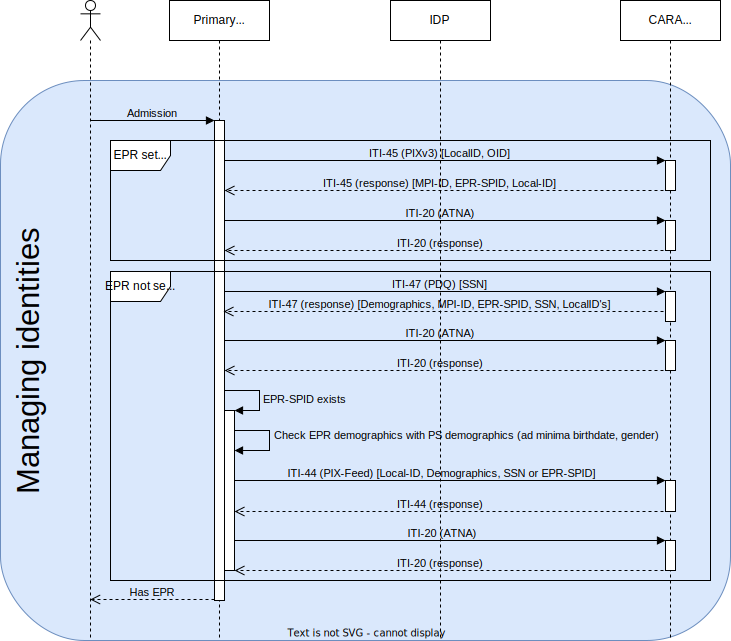
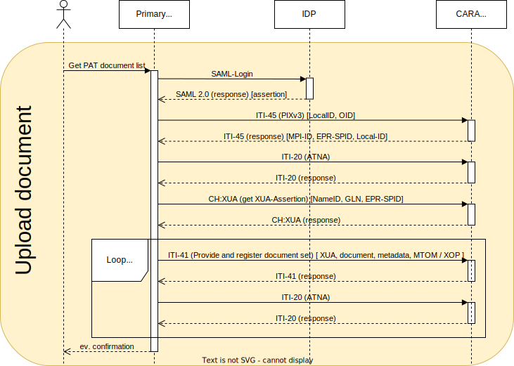

For a deep EPR integration into a primary systems the following usecases should be covered

1. Integrate the strong authentication into the primary system with an IdP (Level 1)
2. Search for patients in the community (Level 2.1)
3. Register a patient from the primary system in the community (Level 2.1)
4. Query and retrieve documents for a patient from the EPR including authorization (Level 2.2)
5. Publish documents for a patient by a healthcare professional (Level 2.2)
6. Providing AuditEvents (Level 2.1)
7. Query and update the Healthcare Professional Directory (HPD) (Level 2.3)
8. OID configuration

The levels of integration are described by eHealth Suisse, see
checklist [[fr]](https://selbstdeklaration.e-health-suisse.ch/upload/documents/Aide_mise_oeuvre_checkliste_anbindung_primaesystemen_F.pdf)
and [[de]](https://selbstdeklaration.e-health-suisse.ch/upload/documents/Umsetzungshilfe_Checklist_Anbindung_Primaersystemen.pdf).

eHealth Suisse has described the different steps with
examples [[fr]](https://www.e-health-suisse.ch/fr/technique-semantique/raccordement-dep/responsables-informatiques.html), [[de]](https://www.e-health-suisse.ch/technik-semantik/epd-anbindung/informatikverantwortliche.html).

You find test patients which you can use for publication of documents [here](testpatients.md).

The healthcare professional portal can be found at [https://professional.test.emedo.ch/login](https://professional.test.emedo.ch/login).

Please find below additional information relevant for CARA and IKIT:

## 1. Integrate the strong authentication into the primary system with and IdP

If you have a test user you can [use the IdP Assertion from IKIT](usecases/#use-the-idp-assertion-from-eprik) until you
have done the IdP integration yourself. 

Note: The NameID has to be currently registered manually on the plattform, please contact us if you want to use strong authentication.

## 2. Search for patients in the community



This sequence diagram shows the preferred way of managing patient identities.
The first case, *EPR set in PS* is the case where you have already linked your local patient identity to an EPR 
patient identity and fed your local identifier to the MPI.
To get the MPI-PID and the EPR-SPID, you just have to query the MPI with your local identifier (described in section 
3.2).

The second case, *EPR not set in PS*, is the case where you have to reconciliate the patient identities.
You can query the MPI for patient demographics (like name, birthdate, gender, etc., described in section 2.2) and 
manually match demographics.
Once that is done, you can feed your patient local identifier to the MPI (described in section 3.1).

### 2.1 Check if the patient has an EPR based on AHVN13/NAVS

With the PIX V3 query You can use AHVN13/NAVS13 to check if the patient has an EPR (EPR-SPID is returned), and if the
patient
is already registered in the community (MPI-PID is returned). See
example [request](https://ikit.cara.ch/dep/#/transaction/fe4f70cc-de27-4b2e-9ea6-9d230ae8f608) for patient
Larissa Weinmann, which returns EPR-SPID and MPI-PID in the id elements. For a test patient who has no EPR (as of 7.7.2025)
with AHVN13 7560739410295 no EPR-SPID and MPI-PID is returned,
see [request](https://ikit.cara.ch/dep/#/transaction/25ba71b3-7352-4f54-a83c-700cdb2f1759). If the the AHVN13 is
not found, an Application Error (AE) will
be [returned](https://ikit.cara.ch/dep/#/transaction/8d0093bc-1e66-4441-a0a2-480ecdf90be8). For a test
patient who has an EPR but not in CARA int (as of 7.7.2025) with AHVN13 7560520619845 only EPR-SPID is returned,
see [request](https://ikit.cara.ch/dep/#/transaction/480b9e79-f9cf-4e87-8468-90a86f6a9c70).

### 2.2 Demographics Query

A search for a patient is done via a demographics query. See detailed
description [here](https://github.com/ehealthsuisse/EPD-by-example/blob/main/files/PDQ.md).

IKIT example [request, response](https://ikit.cara.ch/dep/#/transaction/2d69a46b-7a85-4b9d-9248-088ab97ff450).
This example search is done on the family name, other demographics query parameters are possible. Please note that Swiss
Extension requires that an error is returned if more than 5 matched are returned.

You need to provide creationTime, sender OID and receiver OID in addition to the query parameters in the request. For the communication you need a client
certificate but with IKIT a client certificate is not necessary.

## 3. Register a patient from the primary system in the community and query the patient community id

### 3.1 Register local patient Id in the community

Register a patient in a community. Primary systems need to use this transaction to register patient data and then to be
able to provide and retrieve documents to the patients EPR. See detailed
description [here](https://github.com/ehealthsuisse/EPD-by-example/blob/main/files/PIXFeed.md).

IKIT example [request, response](https://ikit.cara.ch/dep/#/transaction/3d201f25-1a7a-415f-ae49-3b90be4a3c1f).
This example registers the local id from the primary system A001 of the patient identity domain 2.16.756.5.30.1.145
in the MPI. You need to provide creationTime, sender OID and receiver OID in addition to the patient parameters
EPR-SPID, MPI-ID) in the request. For the communication you need a client certificate, but with IKIT a client
certificate is not necessary.

!!! danger

    Never feed a patient identifier with a domain that is not yours, and especially a domain equal to the configured
    receiver OID of the platform. It would make the patient unreachable from PDQ queries. The OID (patient assigning authority) needs to be configured first, otherwise it will give an error.

### 3.2 Query MPI-PID and EPR-SPID based on local ID

The primary systems needs to query the master patient ID (MPI-ID) for patients to retrieve or provide documents for,
based on the local id registered above. See detailed
description [here](https://github.com/ehealthsuisse/EPD-by-example/blob/main/files/PIXQuery.md).

IKIT example [request, response](https://ikit.cara.ch/dep/#/transaction/c51533bc-e10f-4235-89ee-2e4e7592c417).

You see in the response that the patient has the MPI-PID 100001143 in 2.16.756.5.30.1.177.2.2.1.1 .

## 4. Query and retrieve documents for a patient from the EPR


This sequence diagram shows the search and retrieval of documents.
Searching documents in emedo is described in section 4.2a, searching in other communities is described in section 4.2b.
Retrieving a document is described in sections 4.3a and 4.3b, depending on the community.
The PIXv3 query is shown as a reminder.
For these calls, another mandatory step is the Get X-User Assertion call to get a XUA token from the EPR.

### 4.1 Authorization

To query and retrieve documents the HCP needs to be authorized based on the IdP or TCU token, the patient (resourceID with
EPR-SPID), purposeOfUse (NORM, EMER) and role (HCP).
See detailed description [here](https://github.com/ehealthsuisse/EPD-by-example/blob/main/files/GetXAssertion.md).

IKIT
example [request, response](https://ikit.cara.ch/dep/#/transaction/49e3463f-596a-402a-b45c-b1ad2234b131).

Example STS requests with [IdP](requests/sts-ikit.http).

### 4.2a Query documents from the community

Retrieve the document metadata for the documents stored in a patients EPR for the  community. See detailed
description [here](https://github.com/ehealthsuisse/EPD-by-example/blob/main/files/RegistryStoredQuery.md).

IKIT example [request, response](https://ikit.cara.ch/dep/#/transaction/46565ff4-bc8e-4489-8394-325cb2ba499d).
For the Query the MPI-ID of the patient needs to be added. This example requests includes the security token necessary.

With the IKIT you can do the user authentication there and reuse the
token [see](usecases/#use-the-idp-assertion-from-eprik). For the communication you need a client certificate but with
IKIT a client certificate is not necessary.

Note 1: You need to add two namespace prefix to your XDS request if you copy the assertion into your request (add xmlns:xsi="http://www.w3.org/2001/XMLSchema-instance" xmlns:s="http://www.w3.org/2001/XMLSchema" to wsse:Security).

### 4.2b Query documents from remote communities

To retrieve the document metadata for the documents stored in a patients EPR but registered in remote communities, the
initiating gateway has to be called with an IIT-18 query. 

IKIT example [request, response](https://ikit.cara.ch/dep/#/transaction/3de59826-9d00-49b8-ba8b-3810fdb721d9).
Gassmann has also documents in the remote community (cara-ith) urn:oid:urn:oid:2.16.756.5.30.1.191.1.0

See Note 1.

### 4.3a Retrieve documents from the CARA community

To retrieve documents from a patients EPR the IHE XDS.b profile and transactions needs to be used. See detailed
description [here](https://github.com/ehealthsuisse/EPD-by-example/blob/main/files/RetrieveDocumentSet.md).

IKIT example [request,response](https://ikit.cara.ch/dep/#/transaction/60ab92ac-d1f2-4548-9a4d-764b9e0becd2).
With IKIT you can do the user authentication there and reuse the
token [see](usecases/#use-the-idp-assertion-from-eprik). For the communication you need a client certificate but with
IKIT a client certificate is not necessary. You will need to add the HomeCommunityId, RepositoryUniqueId and
DocumentUniqueId.

Note 2: You need to add a start-info to the Content-Type header (e.g: Content-Type: multipart/related; boundary=uuid:f42c35e4-54b2-45ca-8fda-ed58b11f6fce;type="application/xop+xml"; start-info="application/soap+xml; charset=utf-8") as well as check Note 1.

### 4.3b Retrieve documents from remote communities

To retrieve the documents stored in remote communities, the initiating gateway has to be called with an ITI-43 query
with the homeCommunityId added from result 4.2b. IKIT
example [request, response](https://ikit.cara.ch/dep/#/transaction/1ea6f104-a8c8-432e-ae07-523b0066149a).

See Note 1 & 2.

## 5. Publish documents for a patient by a healthcare professional



This sequence diagram shows the publication of a document by a healthcare professional.

To provide documents and metadata about the documents the IHE XDS.b profile and transactions needs to be used. See
detailed description [here](https://github.com/ehealthsuisse/EPD-by-example/blob/main/files/ProvideAndRegister.md).

IKIT example [request,response](https://test.ahdis.ch/eprik-cara/#/transaction/5e770d0b-db8c-4fda-8ed5-8a2128a162c8).
With IKIT you can do the user authentication there and reuse the
token [see](usecases/#use-the-idp-assertion-from-eprik). For the communication you need a client certificate but with
IKIT a client certificate is not necessary. You will need to add metadata for the document.

### confidentiality code in metadata

The patient can set the default level of confidentiality to normally accessible , restricted accessible or secret. This
need to be taken into account when
publishing ([sequence diagram](https://ehealthsuisse.ihe-europe.net/docs/sequence_diagrams/2_03_EPR_HPStoreDocuments.plantuml.png)).
If a publication fails for normally accessible it has to be retried with restricted accessible. It is only possible to
publish a document with confidentiality secret if the user has set the default confidentiality code to secret. To test
this three different patients have been setup with different confidentiality codes: GASSMANN-IMHOLZ (normally
accessible, EPR-SPID: 761337613645876216), SOARES JESUS (restricted accessible, EPR-SPID 761337616638768604) et
Ratchawat (secret: EPR-SPID 761337610888245779)

| Publication with                     | normal | restricted | secret |
|--------------------------------------|--------|------------|--------|
| Gassmann (normally accessible)       | ok     | ok         | error  |
| SOARES JESUS (restricted accessible) | error  | ok         | error  |
| Ratchawat (secret)                   | error  | error      | ok     |

### metadata in portal

TODO: 

The portal displays the metadata provided in the publication. The patient name is only visible if it is provided in
PID-5
in [sourcePatientInfo](https://profiles.ihe.net/ITI/TF/Volume3/ch-4.2.html#4.2.3.2.23). [example](https://test.ahdis.ch/eprik-cara/#/transaction/e1159556-36e9-41c1-b9d4-740d21d0bf8b)

The institution can be filtered by the portal only if the `authorInstitution` contains an OID in the XON.10 field.

### provide a document with a technical user (TCU)


This sequence diagram shows the publication of a document by a technical user.

Instead of using an authenticated user for publishing documents, the ERP allows to publish documents with a technical
user [see factsheet in french](https://www.e-health-suisse.ch/fileadmin/user_upload/Dokumente/2019/F/fiche-dinformation-utilisateur-technique-dep.pdf).
You are required to create a client certificate for this technical user and let it register in the HPD. See
the [developer platform](https://developer.post.ch/en/e-health/basic-epr-workflows) for exact steps.

IKIT allows you to work with a specific test technical user during integration. You can get the TCU IdP SAML2 assertion
from [here](https://ikit.cara.ch/idp/). This assertion is valid for 10 minutes. With this assertion you
can get then the XUA (STS) token for the XDS requests, for the urn:e-health-suisse:principal-id you need to put the GLN
to 2012345681729 when using IKIT's technical user EPR INT Emedo Frehner.
[example](https://ikit.cara.ch/dep/#/transaction/84a97266-e842-43f1-956a-80f0a96eb511)

### change metadata of existing documents (2.223)

TODO new platform:
If a document has been added the metadata can be changed with the IHE Restricted Metadata Update
Profile [(RMU)](https://www.ihe.net/uploadedFiles/Documents/ITI/IHE_ITI_Suppl_RMU.pdf). See an example message here,
where the document title
is [changed](TODO https://test.ahdis.ch/eprik-cara/index.html#/transaction/d6e2b67b-8f0f-44ca-b7f0-36e56391922c). A new
ITI-18 query shows the
changed [title (Line 312)](https://test.ahdis.ch/eprik-cara/index.html#/transaction/6ab0d5fb-6c20-4ee1-ae83-d82fbbf1ec32).
If you are working with a Technical User you would need to store the DocumentEntry including entryUUID during the
provide and register transaction, because you cannot read it with ITI-18.

### Replace a document

To replace a document, the same ITI-41 transaction is used as for the publication of a new document, with the 
addition of a specific `Association` element that shows which document is to be replaced:

```xml
<rim:Association associationType="urn:ihe:iti:2007:AssociationType:RPLC"
                 sourceObject="urn:uuid:fa9b4f10-3ea1-436f-a988-ebbb8a2cfffc"
                 targetObject="urn:uuid:42fbb7ad-fe7a-4585-95c6-15d91a476c40"
                 id="(a unique id)"/>
```

TODO new platform:
IKIT example [request,response](https://test.ahdis.ch/eprik-cara/#/transaction/5e770d0b-db8c-4fda-8ed5-8a2128a162c8).

### Using entryUUIDs

!!! warning

    The documents entryUUIDs may change at any time: if the metadata changes (through an ITI-92 transaction, or if 
    the patient changes the confidentiality level), or if the document is replaced, a new entryUUID will be generated.

To change the metadata of a document, or to replace it with a new document, the entryUUID of the currently approved 
DocumentEntry is required, and may be different from the submitted entryUUID in the original publication. In some 
cases, it may prove impossible to retrieve the right entryUUID. In those cases, the help from CARA's administrators 
can be requested, or the document may be republished as a new document.

To retrieve the currently approved entryUUID of a document that has not been replaced, if a healthcare professional 
is logged in, the ITI-18 search can be used with the document unique ID. If a technical user is logged in, there is 
no possibility. Depending on the configured confidentiality levels, the document may not be returned in the search.

To retrieve the currently approved entryUUID of a document that has been replaced, the ITI-18 _GetRelatedDocuments_ 
search can be used to retrieve the document that replaced the original document. A loop may be needed, if the 
document has been replaced multiple times.


## 6. Providing AuditEvents

Each IHE Transaction has AuditEvent requirements.
This is described for each transaction (see example for
ITI-45 [here](https://github.com/ehealthsuisse/EPD-by-example/blob/main/files/PIXQuery.md#audit-log) or
in [eprik](https://test.ahdis.ch/eprik-cara/index.html#/transaction/02bc28f6-03b6-4d8b-ae7f-34a889267152)).
This AuditEvents need to be registered in the community.
With [EVSClient](https://ehealthsuisse.ihe-europe.net/evs/atna/validator.seam?standard=21) you can validate if the
content of the AuditMessages is correct.
See for sending message via syslog protocol also guidance about not using BOM
in [IHE 3.20.4.1.2 Message Semantics](https://profiles.ihe.net/ITI/TF/Volume2/ITI-20.html#3.20.4.1.2).

The specifications for generating the audit messages are given in the following documents:

1. [DICOM PS3.15 A.5](https://dicom.nema.org/medical/dicom/current/output/chtml/part15/sect_A.5.html): the
   foundation of audit messages.
2. [IHE profile for each transaction](https://profiles.ihe.net/ITI/TF/Volume2/index.html): in the section 'Security
   Considerations' of each transaction, you'll find IHE requirements.
3. [EPDV-EDI Annex 5 Complement 1](https://www.fedlex.admin.ch/eli/oc/2023/221/de/annexes): there are some Swiss
   requirements too. §1.5.2 describes generic requirements and §1.6.4.3.5.1 describes requirements for transactions
   that use a SAML assertion (XUA).

[EPD-by-example](https://github.com/ehealthsuisse/EPD-by-example) has some examples of audit messages.

## 7. Query and modify the Healthcare Professional Directory (HPD)

The HPD is an LDAP directory, and interactions with it are wrapped in DSMLv2 objects.
It contains three different objects: professionals (_ou=HCProfessional_), organizations (_ou=HCRegulatedOrganization_)
and relationship between them (_ou=Relationship_).

### 7.1 Query entries

With the [ITI-58](https://www.ihe.net/uploadedFiles/Documents/ITI/IHE_ITI_Suppl_HPD.pdf) transaction, you can query the
Healthcare Professional Directory (HPD) for the entries you are interested in.
You can query entries with LDAP filters on LDAP attributes and select the attributes to return.
[Example](https://ikit.cara.ch/dep/#/transaction/804e7064-f21a-4c7c-98f0-aeea2e0902d4), [request](https://github.com/CARA-ch/ikit-docs/blob/main/docs/requests/iti-59-int-add.http).

### 7.2 Add an entry

With the [ITI-59](https://www.ihe.net/uploadedFiles/Documents/ITI/IHE_ITI_Suppl_HPD.pdf) transaction, you can add an
entry to the HPD with an _addRequest_.
[Example]https://ikit.cara.ch/dep/#/transaction/e71b48eb-d65a-4e01-b221-26b5e7c476e2), [request](https://github.com/CARA-ch/ikit-docs/blob/main/docs/requests/iti-59-int-add.http).

### 7.3 Modify an entry

With the [ITI-59](https://www.ihe.net/uploadedFiles/Documents/ITI/IHE_ITI_Suppl_HPD.pdf) transaction, you can update an
entry in the HPD with a _modifyRequest_.
[Example](https://ikit.cara.ch/dep/#/transaction/d85ac270-97d0-4915-9bcb-3a2d117a20d2), [request](https://github.com/CARA-ch/ikit-docs/blob/main/docs/requests/iti-59-int-modify.http).

### 7.4 Delete an entry

With the [ITI-59](https://www.ihe.net/uploadedFiles/Documents/ITI/IHE_ITI_Suppl_HPD.pdf) transaction, you can delete an
entry from the HPD with a _delRequest_.
[Example](https://ikit.cara.ch/dep/#/transaction/3ecd8b6b-480c-4e1e-827c-598581296bfd), [request](https://github.com/CARA-ch/ikit-docs/blob/main/docs/requests/iti-59-int-delete.http).

## 8. OID Configuration

TODO 

| Parameter                 | Integration                         | Production                         |
|---------------------------|-------------------------------------|------------------------------------|
| MPI OID Patient           | 2.16.756.5.30.1.177.2.2.1.1         | TODO                               |
| HL7 v3 Receiver Device ID PIX V3 | 2.16.756.5.30.1.177.2.2.1.1.3       | 2.16.756.5.30.1.177.2.2.2.1.3   |
| HL7 v3 Receiver Device ID PDQ V3 | 2.16.756.5.30.1.177.2.2.1.1.7       | 2.16.756.5.30.1.177.2.2.2.1.7    |
| Repository unique ID      | 2.16.756.5.30.1.177.2.2.1.1.2                   |                                    |
